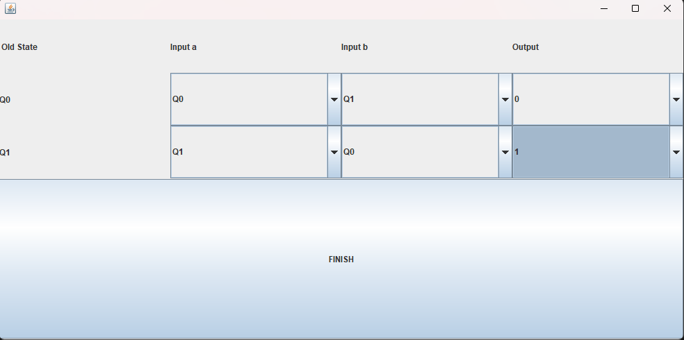

# Moore Machine Simulator (Java Swing)

A desktop application for designing and simulating Moore Machines, built with Java Swing.

Originally developed as a university project and later repackaged for demonstration and portfolio purposes.

---

## Features

- Create finite state machines with up to 20 states
- Define custom alphabets and outputs
- Configure state transitions visually
- Simulate input strings
- Observe state progression and generated outputs
- Simple and interactive GUI

---

## Screenshots

### Machine Configuration


### Transition Table


### Input Simulation


### Result Visualization


---

## Download & Run

### Requirements
- Java 8 or higher

### Run the application

Download the latest `.jar` from the **Releases** section:

👉 https://github.com/YOUR_USERNAME/YOUR_REPO/releases

Then run:

```bash
java -jar moore-machine-simulator.jar
